# 경영집행위원회(Executive Committee) 플랫폼 — 프로젝트 업무 현황 보고서

| 항목 | 내용 |
| --- | --- |
| 프로젝트명 | 경영집행위원회 회의록 솔루션 (Executive Committee Platform) |
| 보고 기준일 | 2026-04-21 |
| 현재 브랜치 | `main` (origin과 동기화됨) |
| 최신 커밋 | `78ac36b` · fix: match MariaDB SQL queries with actual target database schema columns |
| 런타임 | Next.js 16.2.3 (App Router + Turbopack) / React 19.2.4 |
| 상태 관리 | Zustand 5 |
| DB 연동 | MariaDB 원격(`119.207.76.94:3306` / DB: `meeting_management`) · Server Actions |
| 문서 | `AUTH_IMPLEMENTATION.md`, `IMPLEMENTATION_SUMMARY.md`, `DESIGN.md`, `mariadb_setup.sql` |

---

## 1. 프로젝트 개요

본 프로젝트는 사내 **경영집행위원회**의 안건 등록 → 사전 검토 → 본회의 진행 → 보고서 출력까지의 전 과정을 디지털화하는 단일 페이지 웹 애플리케이션이다. 음성 기록을 통한 AI 자동 요약, 안건별 표결, CEO 전략 보고서 자동 생성까지 한 플랫폼 안에서 처리한다. 디자인 컨셉은 "The Digital Curator"로, 라인을 최소화(No-Line Rule)하고 명도·여백 기반의 갤러리형 레이아웃을 적용한다(`DESIGN.md` 참고, 브랜드 컬러 Deep Emerald `#2a676c`).

운영 시나리오 한 문장 요약: **안건을 업로드하고, 사전 검토로 의견을 모으고, 실시간 회의에서 음성 요약·표결을 수행하며, 종료와 동시에 회의록·CEO 보고서가 자동 생성되어 PDF로 다운로드된다.**

---

## 2. 기술 스택 및 아키텍처

런타임은 Next.js 16.2.3 App Router에 Turbopack을 사용하며, 프론트는 React 19 기반으로 구성되었다. 상태 관리는 Zustand 5(`uiStore`, `agendaStore`, `liveMeetingStore`, `meetingStore`, `authStore`)로 책임을 분할하였고, 서버 데이터 접근은 Next.js Server Actions(`lib/services/databaseService.ts`)를 통해 MariaDB 풀(`lib/db.ts` — `mysql2`)에 직접 연결하는 구조이다. PDF는 `jspdf` 2.5.2, 아이콘은 `@phosphor-icons/react`, 스타일링은 Tailwind CSS v4(전역 `globals.css` + 디자인 토큰) 기반이다.

루트 페이지는 `AppHeader + WorkflowSection + ArchiveSection + ModalManager`로 구성된 단일 대시보드 구조이며, 기능은 대부분 모달·드로어 단위로 분리되어 있다. 인증은 완전 클라이언트 사이드(Zustand + localStorage)이며, `AuthProvider.tsx`가 최상위 레이아웃에서 로그인 여부에 따라 `/login`으로 리다이렉트한다. AI 관련 엔드포인트는 `/api/ai/summarize`, `/api/ai/minutes`에 Next Route Handler로 구현되어 있으며, 현재는 외부 LLM 대신 키워드·문장 길이 기반의 로컬 텍스트 분석으로 동작한다(Phase 3에서 Claude API로 교체 예정).

DB 스키마(`mariadb_setup.sql`)는 `profiles`, `meeting_rounds`, `agendas`, `ceo_reports` 4개 테이블로 구성되며, 각 테이블은 회차(id)·안건(id+meeting_id) 기반의 정규화 설계이다. 참석자(attendees), 주요 의사결정(key_decisions), 조치사항(action_items), 리스크, 기회는 모두 JSON 컬럼으로 저장된다. 실제 원격 DB에 샘플 데이터 5개 회차와 5개 안건이 초기 시드되어 있다.

---

## 3. 구현 완료 기능 (Feature Completion)

### 3.1 인증 및 권한

로그인 페이지(`/login`)는 이메일+비밀번호 기반이며, 로그인 성공 시 세션이 `localStorage`에 영속화되어 새로고침 후에도 유지된다. `AuthProvider`는 모든 라우트에 대한 보호를 담당하며, 비인증 사용자는 자동으로 `/login`으로 튕겨낸다. 데모 계정은 `abc@naver.com` / `abc1234` (관리자)로, 초기 사용자 목록이 없는 경우 `authStore`에서 자동으로 시드한다.

권한은 `user`/`admin` 두 단계로 관리된다. 관리자는 앱 헤더의 아바타 드롭다운에서 "관리자 패널"에 접근할 수 있으며, 패널 내에서 사용자 목록 조회, 사용자 추가, 권한 승격·강등, 사용자 삭제가 가능하다. 안전장치로 (1) 자기 자신의 권한 변경 금지, (2) 자기 자신 삭제 금지, (3) 마지막 관리자 삭제 금지, (4) 이메일 중복 방지 규칙이 적용되어 있다. 비밀번호 해싱, JWT, 이메일 인증 등 프로덕션 보안 요소는 `AUTH_IMPLEMENTATION.md`의 "Phase 3+" 항목에 향후 과제로 명시되어 있다.

### 3.2 워크플로우 대시보드 (4단계)

메인 대시보드는 1단계 `안건 업로드` → 2단계 `사전 검토` → 3단계 `본회의 진행(LIVE)` → 4단계 `보고서 출력`의 4카드 워크플로우로 구성된다. 각 카드는 클릭 시 해당 모달/드로어를 띄우며, 현재 LIVE 상태가 진행 중일 경우 3번 카드에 펄스 표시가 붙는다. 대시보드 상단에서는 `MeetingRoundEditor`를 통해 `{연도} {회차} {정기/임시}` 라벨을 인라인 편집할 수 있고, 하단 `Archive & Tracking` 섹션은 `KpiGlances`(총/진행/딜레이/완료)와 `AgendaTable`(연도 필터, 안건 검색, 이행 상태 뱃지) 조합으로 구성된다.

### 3.3 안건 업로드 드로어

`AgendaUploadDrawer`는 우측에서 슬라이드되는 드로어로, 한 회의에 여러 개의 안건을 동시에 등록할 수 있다. 각 안건 아이템은 (제목 + 간략 설명 + PDF/DOCX 첨부) 구조이며, "+ 안건 추가" 버튼으로 동적으로 아이템을 늘릴 수 있다. 데이터는 `agendaStore`(Zustand)에 저장되어 후속 단계(사전 검토, 본회의)에서 공유된다.

### 3.4 사전 검토 드로어

`PreviewDrawer`는 등록된 안건별로 위원들이 사전 의견(코멘트)을 남길 수 있는 화면이다. 안건별 탭 전환, 작성자 이니셜/컬러 아바타, 첨부파일 지원 등이 포함되어 있다. 실제 의견 저장은 `agendaStore`의 `previewComments` 배열에 로컬 상태로 관리된다.

### 3.5 본회의 진행 (Live Meeting)

`MeetingStartModal`에서 날짜·시간·장소를 지정하고, 등록된 안건 중 이번 회의에서 다룰 안건을 체크박스로 선택하면 `LiveMeetingModal`(풀스크린 모달)로 전환된다. 상단에 `LIVE REC` 인디케이터와 경과시간 타이머가 고정되며, 좌측 사이드바(`LiveSidebar`)에서 오프닝→안건1→안건2→...→클로징 순으로 단계 이동이 가능하다. 각 안건 단계(`AgendaPanel`)에서는 안건 요약 카드(`SummaryCard`), 표결 툴바(`VotingToolbar`, 승인/조건부/재검토 3단 표결), 음성 인식 훅(`useSpeechRecognition` — Web Speech API)이 제공된다. 클로징 단계(`ClosingPanel`)에서 "회의 종료"를 클릭하면 `meetingSaver.saveCompletedMeeting()`이 호출되어 `localStorage`에 회차·안건·음성기록·소요시간·표결 집계가 영속화된다.

### 3.6 보고서 출력 (회의록 + CEO 보고서)

`ReportModal`은 좌측 사이드바(`ReportSidebar`, 연도별·회차별 역순 정렬, 승인/조건/재검토 건수 배지)와 우측 패널(`ReportPanel`, "회의록" / "CEO 보고서" 탭)로 구성된 회의 이력 뷰어다. 표시되는 데이터는 `getCompletedMeetings()`(localStorage) + 목데이터의 병합 결과이며, DB 연동 쿼리(`getMeetingRounds`)도 준비되어 있다.

**회의록 탭**은 기본정보, 참석자, AI 요약, 안건별 표결 결과 표, 안건별 음성 기록 상세를 보여주고, PDF 다운로드 시 `pdfGenerator.ts` + `jsPDF`가 한글 글꼴로 포맷된 문서를 생성한다(파일명: `회의록_{roundId}.pdf`). **CEO 보고서 탭**은 `ceoReportGenerator.ts`의 `generateCeoReport()`가 표결 결과를 분석하여 (전략 요약, 주요 의사결정 3~5건, 조치사항, 위험 요소, 기회 요소) 5개 섹션을 자동 생성하고, "CEO 보고서 PDF 다운로드"로 별도 파일(`CEO_보고서_{roundId}.pdf`)을 내보낸다.

### 3.7 아카이브 & 트래킹

`ArchiveSection`에서는 과거 모든 안건을 표 형태로 조회하고, 이행 기한과 진행 상태(`진행중`, `딜레이`, `완료`) 뱃지를 관리한다. KPI 카드(`KpiGlances`)에는 총 안건 수, 진행중, 딜레이, 완료 건수가 집계되며, 연도 필터와 텍스트 검색이 동시에 적용된다.

### 3.8 AI 요약 / 회의록 자동 생성 API

`/api/ai/summarize`는 안건별 음성 기록을 받아 (요약 1문단 + 핵심 포인트 상위 5개)를 반환한다. 중요 키워드(결정, 승인, 반대, 예산, 일정, 계획 등 20여 개) 포함 문장을 우선 추출하고, 키워드 매칭이 없으면 가장 긴 문장 3개를 핵심 포인트로 사용하는 정책이다. `/api/ai/minutes`는 회의 메타데이터 + 안건 + 표결 + 음성 기록을 받아 마크다운 형식의 회의록 전문을 생성한다(회의 개요 표, 표결 결과 요약, 안건별 상세, 종합 의견, 향후 조치사항 순). `/api/ai/ceo-report`는 아직 폴더만 존재하며 핸들러 파일은 미구현 상태이다(아래 4.1 참고).

---

## 4. 이슈 및 리스크

### 4.1 CEO 보고서 API 엔드포인트 미구현

`app/app/api/ai/ceo-report/` 디렉터리가 존재하지만 `route.ts` 파일이 없다. 현재 CEO 보고서는 클라이언트의 `ceoReportGenerator.ts`만으로 생성되고 있으며, 향후 Claude API 연동을 위해서라도 해당 라우트 핸들러를 채워야 한다.

### 4.2 Phase별 구현 갭

`IMPLEMENTATION_SUMMARY.md`에 따르면 Phase 2까지의 기능은 완료되었으나, Phase 3로 예정된 항목 — **실제 Claude API 연동**, **Web Speech API 음성 캡처의 정확도 보정**, **localStorage → DB 완전 이관** — 은 아직 착수되지 않았다. 현재 음성 요약은 서버 측에서 키워드·길이 휴리스틱에 의존하므로, 회의 내용이 짧거나 전문 용어가 많을 때 요약 품질이 저하될 수 있다.

### 4.3 영속성 이원화 (localStorage + MariaDB)

완료된 회의는 `meetingSaver.ts`를 통해 `localStorage` 키 `completed_meetings`에 저장되지만, `ReportModal`은 이를 mock 목데이터 및 DB 쿼리 결과와 병합하여 표시한다. 브라우저를 바꾸거나 localStorage가 초기화되면 회의 데이터가 유실된다. Phase 3의 DB 이관 과제와 직결되며, `mariadb_setup.sql`에서 준비된 `meeting_rounds` / `agendas` 테이블을 활용한 `POST /api/meetings` 엔드포인트 신설이 필요하다.

### 4.4 보안 / 인증 측면

비밀번호가 평문으로 `localStorage`에 저장되며, 로그인 검증도 전적으로 클라이언트에서 수행된다(`authStore.login`). 현재는 내부 데모 수준이나, 실제 배포 단계에서는 (1) 서버 기반 JWT/세션, (2) `bcrypt`/`argon2` 해싱, (3) HTTPS 강제, (4) 로그인 시도 제한(Rate limiting)이 필수이다. `AUTH_IMPLEMENTATION.md` 섹션 6에 같은 취지가 명시되어 있다.

### 4.5 배포 환경 이슈

`package.json` 및 커밋 히스토리에서 Vercel 배포를 여러 번 수정한 흔적이 있다(flat → nested 구조 변경, 누락된 Supabase 의존성 제거 등). 현재는 MariaDB 외부 접속 기반이므로 Vercel 서버리스 함수에서 MariaDB 포트(3306)에 직접 접속할 수 있는지(화이트리스트), 연결 풀링이 콜드 스타트에 어떻게 작동하는지 별도 검증이 필요하다. `.env.local`에 DB 자격증명이 평문으로 들어있어 프로덕션 배포 시 반드시 환경 변수로 분리해야 한다.

### 4.6 미정리 잔여 파일

`app/query_test.js`, `app/query_test2.js` 파일이 git 미추적 상태로 남아 있으며, `lib/mock/` 디렉터리의 목데이터는 프로덕션 이관 시 제거되어야 한다. `Management_committee2.html`(88KB)은 초기 프로토타입 HTML로 보이며 현재 코드와 중복되는 부분이 많으니 레거시 문서로 분리 보관을 권장한다.

---

## 5. 파일 구조 (요약)

```
mgmt/
├── AGENTS.md, CLAUDE.md, DESIGN.md, README.md
├── AUTH_IMPLEMENTATION.md, IMPLEMENTATION_SUMMARY.md
├── mariadb_setup.sql             # DB 초기화 스크립트
├── Management_committee2.html    # 초기 프로토타입 (88KB)
└── app/
    ├── app/
    │   ├── page.tsx                      # 메인 대시보드
    │   ├── layout.tsx                    # 전역 레이아웃 + AuthProvider
    │   ├── AuthProvider.tsx              # 라우트 보호
    │   ├── login/page.tsx                # 로그인 화면
    │   ├── meetings/page.tsx             # 회의 관리 (목록)
    │   └── api/ai/
    │       ├── summarize/route.ts        # 음성 요약
    │       ├── minutes/route.ts          # 회의록 생성
    │       └── ceo-report/               # 라우트 핸들러 미구현 ⚠
    ├── components/
    │   ├── layout/AppHeader.tsx
    │   ├── dashboard/{WorkflowSection,WorkflowStepCard,MeetingRoundEditor}.tsx
    │   ├── archive/{ArchiveSection,AgendaTable,KpiGlances,StatusBadge}.tsx
    │   └── modals/
    │       ├── ModalManager.tsx
    │       ├── admin/AdminModal.tsx
    │       ├── agenda-upload/{AgendaUploadDrawer,AgendaItemForm}.tsx
    │       ├── preview/PreviewDrawer.tsx
    │       ├── meeting-start/MeetingStartModal.tsx
    │       ├── live-meeting/
    │       │   ├── LiveMeetingModal.tsx, LiveSidebar.tsx
    │       │   ├── panels/{OpeningPanel,AgendaPanel,ClosingPanel}.tsx
    │       │   └── voting/{VotingToolbar,SummaryCard}.tsx
    │       └── report/{ReportModal,ReportSidebar,ReportPanel}.tsx
    └── lib/
        ├── db.ts                        # mysql2 풀
        ├── services/databaseService.ts  # Server Actions (CRUD)
        ├── store/{ui,agenda,liveMeeting,meeting,auth}Store.ts
        ├── types/meeting.ts
        ├── utils/{pdfGenerator,ceoReportGenerator,meetingSaver,meetingRound}.ts
        ├── hooks/useSpeechRecognition.ts
        └── mock/{meetings,archive}.ts
```

---

## 6. 개발된 화면 스크린샷

실제 개발 서버(Next.js 16.2.3, `http://localhost:3000`)를 기동하여 캡처한 화면이다. DB가 원격 폐쇄망에 있어 해당 쿼리가 실패하는 화면은 목데이터 기반으로 렌더링됨을 명시한다.

### 6.1 로그인 화면 (`/login`)

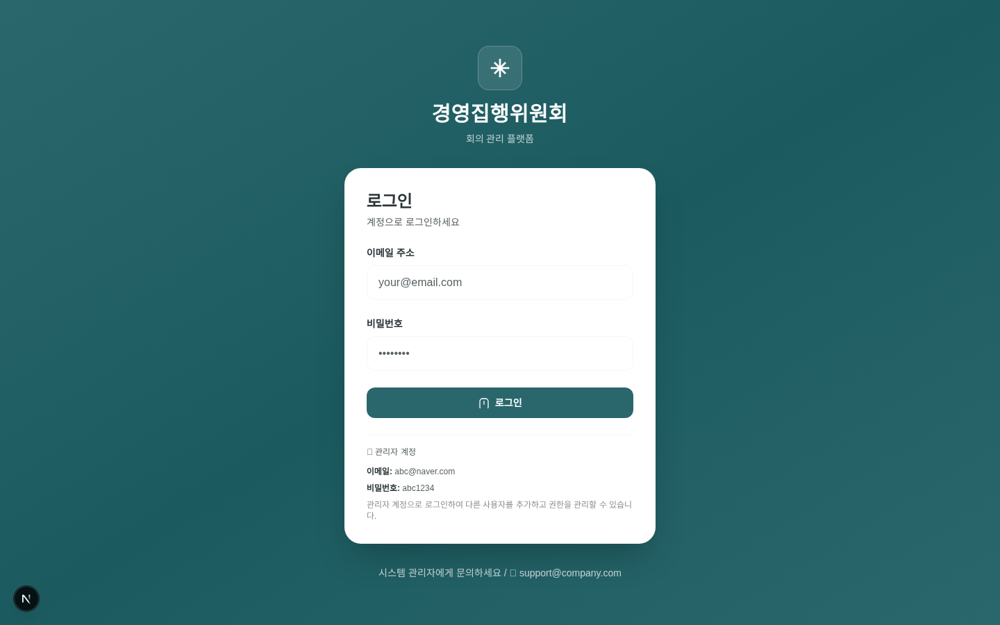

Deep Emerald 그라데이션 배경 위에 글래스 카드 형태로 구성. 데모 계정 정보(`abc@naver.com` / `abc1234`)가 폼 하단에 안내되며, 비인증 사용자는 모든 경로에서 이 페이지로 리다이렉트된다.

### 6.2 로그인 입력 상태


### 6.3 메인 대시보드 — 4단계 워크플로우

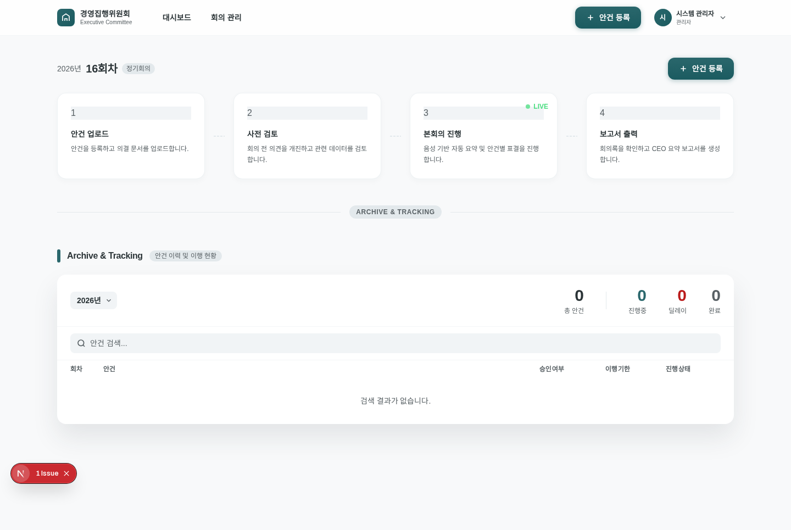

회차 라벨(2026년 16회차 정기회의) 인라인 편집기, 안건 업로드 → 사전 검토 → 본회의 진행(LIVE) → 보고서 출력의 4카드 워크플로우, 우측 상단 "안건 등록" 기본 CTA 및 아바타·사용자 드롭다운을 확인할 수 있다.

### 6.4 Archive & Tracking 섹션

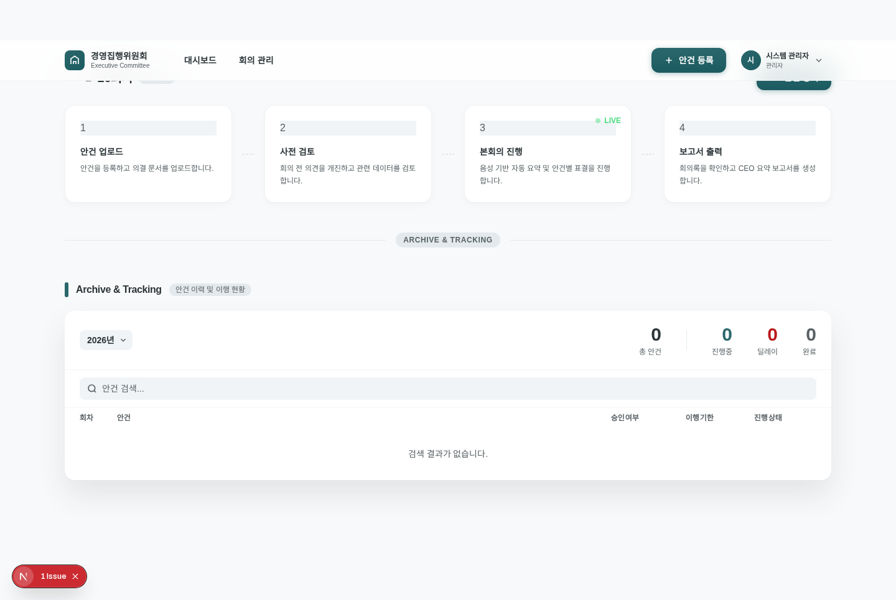

연도 필터(2026년), KPI 4종(총 안건/진행중/딜레이/완료), 안건 검색 바, 안건 이행 현황 테이블이 배치된 섹션이다.

### 6.5 안건 업로드 드로어 (1단계)

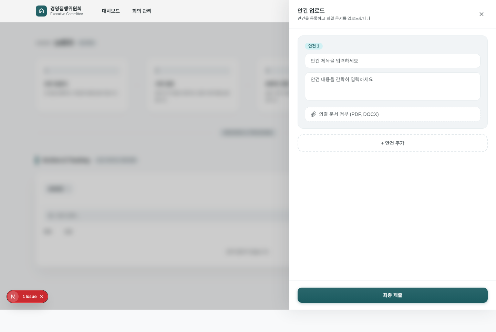

우측 슬라이드 드로어. 제목/내용/첨부(PDF·DOCX) 입력 섹션과 "+ 안건 추가" 버튼, 하단 Primary Gradient "최종 제출" 버튼으로 구성된다.

### 6.6 사전 검토 드로어 (2단계)

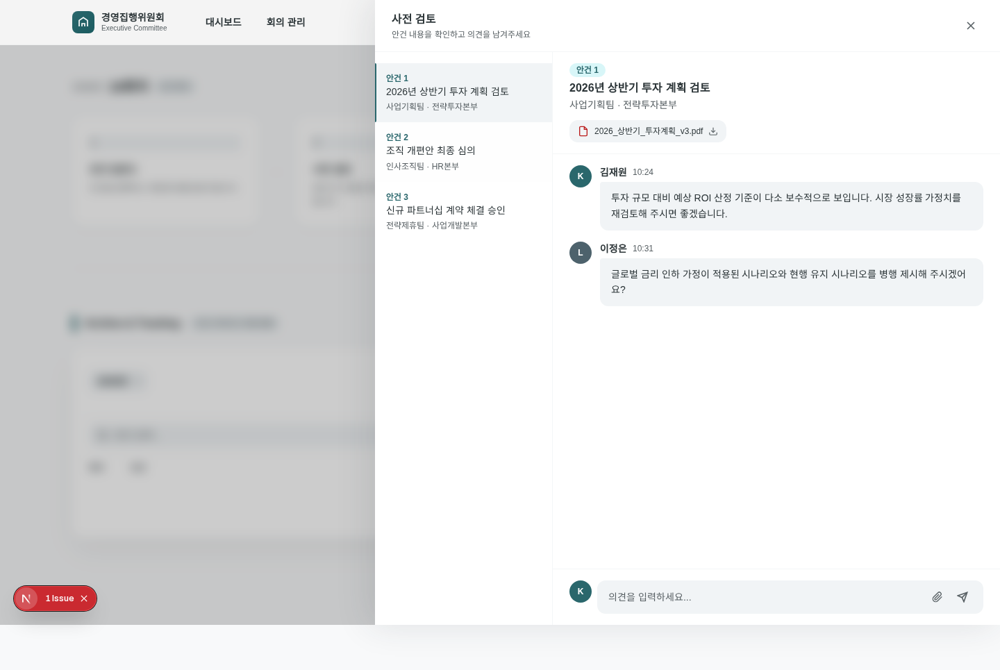

### 6.7 본회의 개최 모달 (3단계 진입)

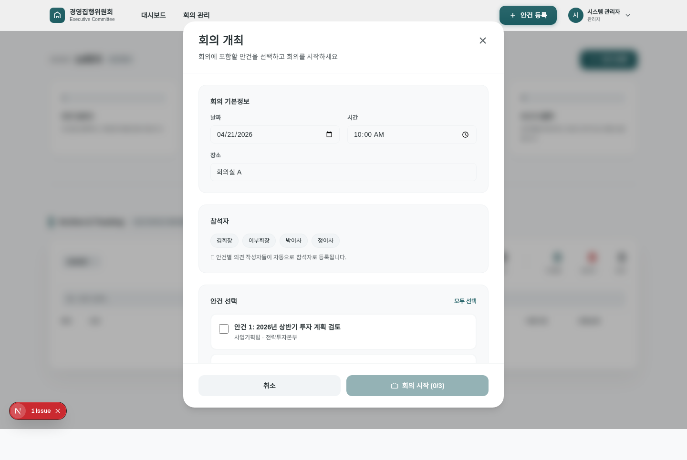

날짜/시간/장소 입력 → 참석자 자동 등록 → 안건 멀티 선택 → "회의 시작 (선택/전체)" 플로우. 본 모달에서 "회의 시작" 클릭 시 풀스크린 LiveMeetingModal로 전환된다.

### 6.8 보고서 출력 — 회의록 탭 (4단계)

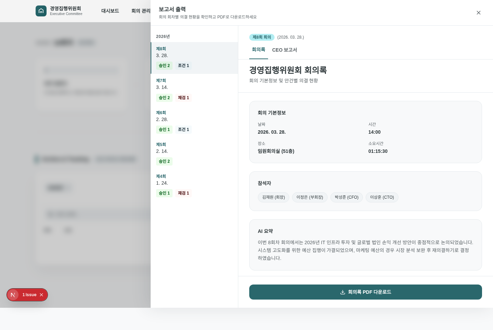

좌측 사이드바에서 회차 선택, 우측 패널에 회의 기본정보, 참석자, AI 요약(`이번 8회차 회의에서는 2026년 IT 인프라 투자 및 글로벌 법인 손익 개선 방안이 중점적으로 논의...`), 하단 "회의록 PDF 다운로드" 버튼이 배치되어 있다.

### 6.9 보고서 출력 — CEO 보고서 탭

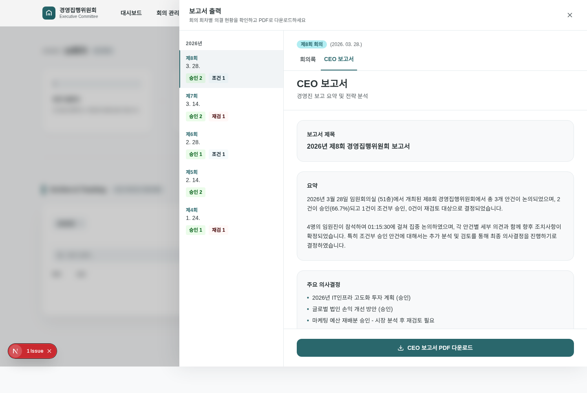

`ceoReportGenerator.ts`로 자동 생성된 전략 요약, 주요 의사결정, 조치사항, 위험 요소, 기회 요소 섹션과 별도의 "CEO 보고서 PDF 다운로드" 버튼.

### 6.10 사용자 드롭다운 메뉴

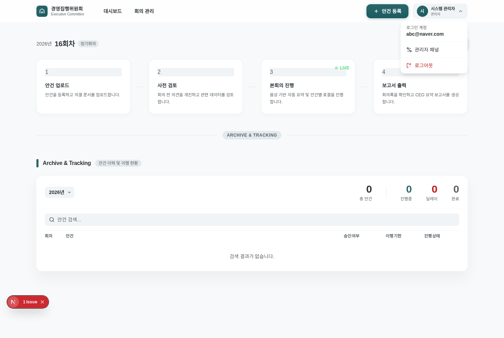

로그인 계정(`abc@naver.com`), 관리자 패널(관리자만 노출), 로그아웃의 3단 구성. 외부 클릭 시 자동 닫힘.

### 6.11 관리자 패널 — 사용자 관리 탭

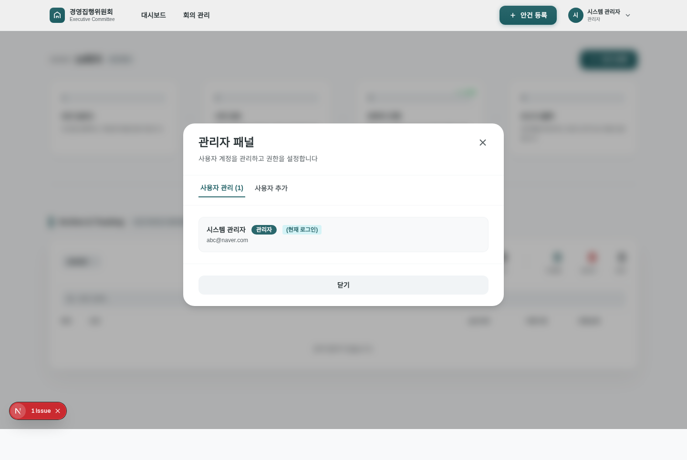

사용자 목록, 역할 뱃지(관리자/사용자), 현재 로그인 표시, 권한 변경·삭제 버튼. 안전장치(마지막 관리자 보호, 자기 자신 보호)가 UI 레벨에서 반영된다.

### 6.12 관리자 패널 — 사용자 추가 탭

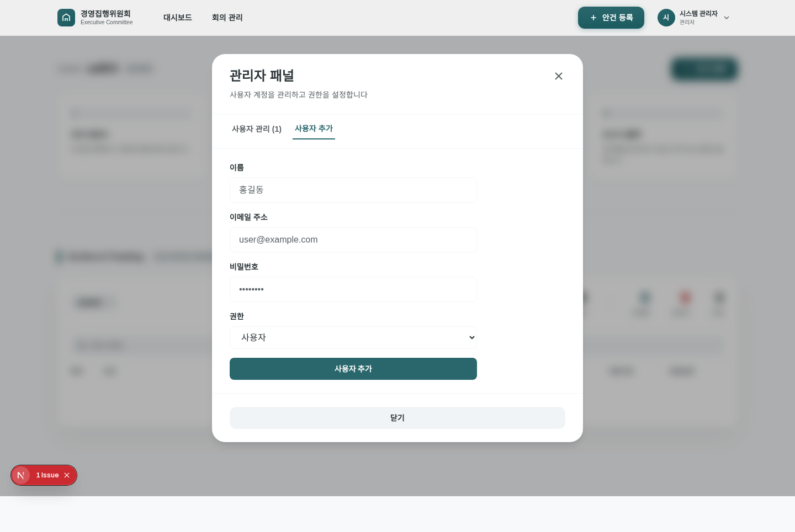

이름/이메일/비밀번호/역할 입력 폼. 이메일 중복 시 에러 메시지 피드백 제공.

---

## 7. 다음 단계 (Next Steps)

단기(1~2주) 범위에서는 `/api/ai/ceo-report/route.ts` 구현, Claude API(`/messages`) 연동, 음성 인식 결과 저장 포맷 정규화, `.env.local`의 DB 자격증명 분리가 우선 과제이다. 중기(3~6주) 범위에서는 localStorage에 잔존하는 회의 이력을 MariaDB로 일괄 이관하고, `/api/meetings` CRUD 엔드포인트를 신설하며, 로그인 시스템을 서버 기반 JWT + bcrypt로 승격해야 한다. 장기 과제로는 (1) 참석자별 의견 분석 대시보드, (2) 회의 재개/수정 기능, (3) Slack·이메일 통한 회의록 자동 공지, (4) 음성 원본 저장을 위한 S3 계열 오브젝트 스토리지 연동이 후보이다.

---

## 8. 요약 (Executive Summary)

Phase 1(기본 워크플로우) 및 Phase 2(CEO 보고서, 회의 개최, 자동 저장)는 완료되었으며 UI/UX 디자인 시스템도 일관되게 구현되어 있다. 남은 핵심 리스크는 **CEO 보고서 API 미구현**, **localStorage 의존성**, **평문 비밀번호 저장 등 인증 보안**, 그리고 **Claude API 미연동으로 인한 요약 품질**이다. Phase 3 착수를 통해 백엔드 영속성과 AI 연동을 순차 해결하면 실제 임원 회의 운영에 투입 가능한 수준이 된다.

*본 보고서는 `/sessions/.../mgmt` 디렉터리의 실제 소스 코드, 커밋 히스토리(`git log`), 문서 파일, 그리고 개발 서버 기동 후 Playwright로 캡처한 스크린샷을 기반으로 작성되었다.*
